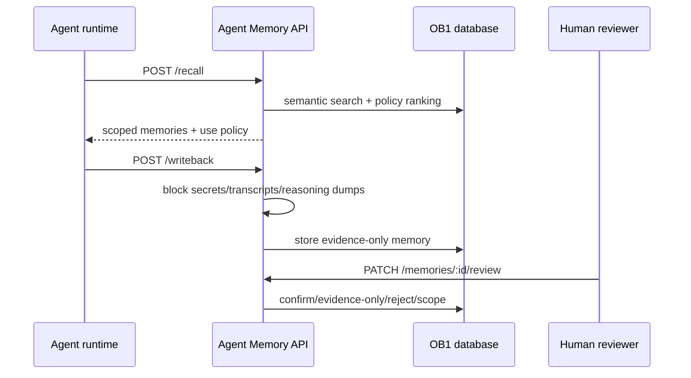

# Agent Memory API

> Runtime-neutral recall, write-back, review, inspection, and trace API for OB1 Agent Memory.



## What It Does

This Edge Function exposes the v1 OB1 Agent Memory contract. OpenClaw is the first launch runtime, but these endpoints are runtime-neutral and can be used by Codex, Claude Code, local agents, n8n, or future SQLite adapters.

## Prerequisites

- Working Open Brain setup ([guide](../../docs/01-getting-started.md))
- [`schemas/agent-memory`](../../schemas/agent-memory/) applied
- Supabase CLI installed
- `OPENROUTER_API_KEY` and `MCP_ACCESS_KEY` configured as Supabase secrets

## Credential Tracker

```text
AGENT MEMORY API -- CREDENTIAL TRACKER
--------------------------------------

FROM YOUR OPEN BRAIN SETUP
  Supabase Project ref:       ____________
  MCP Access Key:             ____________
  OpenRouter API Key:         ____________

GENERATED DURING SETUP
  Agent Memory API URL:       ____________
  Agent Memory API URL + key: ____________

--------------------------------------
```

## Steps


Apply [`schemas/agent-memory/schema.sql`](../../schemas/agent-memory/schema.sql).

**Done when:** the `agent_memories` and `agent_memory_recall_traces` tables exist.


Copy this folder into your Supabase project:

```bash
supabase functions new agent-memory-api
cp integrations/agent-memory-api/index.ts supabase/functions/agent-memory-api/index.ts
cp integrations/agent-memory-api/deno.json supabase/functions/agent-memory-api/deno.json
supabase functions deploy agent-memory-api --no-verify-jwt
```

**Done when:** `supabase functions list` shows `agent-memory-api` as active.


```bash
curl "https://YOUR_PROJECT_REF.supabase.co/functions/v1/agent-memory-api/health?key=YOUR_MCP_ACCESS_KEY"
```

**Done when:** the response includes `"ok": true`.

## API Surface

The API accepts the runtime-neutral core schema versions and the OpenClaw launch aliases:

| Contract | Runtime-Neutral | OpenClaw Alias |
| -------- | --------------- | -------------- |
| Recall request | `openbrain.agent_memory.recall.v1` | `openbrain.openclaw.recall.v1` |
| Recall response | `openbrain.agent_memory.recall_response.v1` | `openbrain.openclaw.recall_response.v1` |
| Write-back request | `openbrain.agent_memory.writeback.v1` | `openbrain.openclaw.writeback.v1` |
| Write-back response | `openbrain.agent_memory.writeback_response.v1` | `openbrain.openclaw.writeback_response.v1` |

| Endpoint | Method | Purpose |
| --- | --- | --- |
| `/health` | GET | Verify deployment |
| `/recall` | POST | Retrieve scoped memories before work starts |
| `/writeback` | POST | Save compact operational memory after work finishes |
| `/recall/:request_id/usage` | POST | Report which recalled memories were used or ignored |
| `/memories/review` | GET | List pending agent-written memories |
| `/memories/:id` | GET | Inspect one memory with source/artifact details |
| `/memories/:id/review` | PATCH | Confirm, edit, reject, restrict, stale, dispute, or supersede |
| `/recall-traces/:request_id` | GET | Debug what was recalled and how it was used |

## Expected Outcome

An agent runtime can recall relevant context, write back compact memories, and leave a trace that explains what happened. Unsafe write-backs are blocked before durable storage.

## Smoke Harness

Use the live smoke harness after deploying the Edge Function or rotating secrets:

```bash
OB1_AGENT_MEMORY_ENDPOINT="https://YOUR_PROJECT_REF.supabase.co/functions/v1/agent-memory-api" \
OB1_AGENT_MEMORY_KEY="YOUR_MCP_ACCESS_KEY" \
OB1_AGENT_MEMORY_WORKSPACE_ID="ob1-staging" \
OB1_AGENT_MEMORY_PROJECT_ID="agent-memory-api-smoke" \
node integrations/agent-memory-api/smoke/live-smoke.mjs
```

The harness checks health, write-back policy defaults, conservative recall gating, include-unconfirmed recall, usage reporting, review action, memory inspection, recall trace, and unsafe write-back blocking. It prints a JSON summary and never prints the access key.

## Troubleshooting

**Issue: `Invalid or missing access key`**
Solution: Confirm the request includes `?key=...` or `x-brain-key`.

**Issue: recall returns no memories**
Solution: Confirm write-back has created `agent_memories`, and that those memories are confirmed or `include_unconfirmed` is true.

**Issue: write-back blocked as unsafe**
Solution: Store a compact summary and artifact links. Do not submit raw transcripts, reasoning traces, secrets, or large code blocks.

## Tool Surface Area

This integration exposes an API that plugins can wrap as tools. See the [MCP Tool Audit & Optimization Guide](../../docs/05-tool-audit.md) before adding additional runtime-specific tool surfaces.
