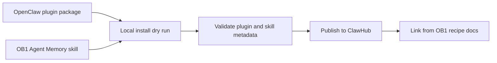

# ClawHub Publishing Notes



This is the publishing checklist for the OpenClaw launch surface. The OB1 core stays runtime-neutral; ClawHub is the distribution path for the OpenClaw plugin and skill.

## Source References

- [OpenClaw skills](https://raw.githubusercontent.com/openclaw/openclaw/main/docs/tools/skills.md)
- [ClawHub](https://raw.githubusercontent.com/openclaw/openclaw/main/docs/tools/clawhub.md)
- [Plugin SDK setup](https://docs.openclaw.ai/plugins/sdk-setup)
- [Building plugins](https://docs.openclaw.ai/plugins/building-plugins)

## Publishable Units

| Unit | Path | Purpose |
| ---- | ---- | ------- |
| Plugin | [plugin](plugin/) | Runtime tools for recall, write-back, usage, inspection, review, and trace lookup |
| Skill | [../../skills/openclaw-agent-memory](../../skills/openclaw-agent-memory/) | Behavior rules for safe memory use inside OpenClaw |
| Bundled plugin skill | [plugin/skills/openclaw-agent-memory](plugin/skills/openclaw-agent-memory/) | Same behavior shipped inside the plugin package for plugin-installed users |
| Recipe | [../../recipes/openclaw-agent-memory](../../recipes/openclaw-agent-memory/) | OB1 setup path and contract examples |

## Commands

Plugin package dry run:

```bash
npx -y clawhub@0.12.2 package publish integrations/openclaw-agent-memory/plugin \
  --family code-plugin \
  --name @openbrain/openclaw-agent-memory \
  --display-name "OpenBrain Agent Memory" \
  --version 0.1.0 \
  --tags agent-memory,openbrain,openclaw \
  --dry-run \
  --json
```

Plugin package publish:

```bash
clawhub package publish integrations/openclaw-agent-memory/plugin \
  --family code-plugin \
  --name @openbrain/openclaw-agent-memory \
  --display-name "OpenBrain Agent Memory" \
  --version 0.1.0 \
  --tags agent-memory,openbrain,openclaw
```

Note: local `clawhub` must be `0.12.2` or newer for `package publish`. Older `0.7.x` builds only expose skill publishing.

Skill search and install flow:

```bash
openclaw skills search "agent memory"
openclaw skills install openclaw-agent-memory
```

Plugin install flow:

```bash
openclaw plugins search "agent memory"
openclaw plugins install clawhub:@openbrain/openclaw-agent-memory
```

## Dry-Run Checklist

- Plugin manifest validates.
- Plugin manifest declares `contracts.tools` for every `openbrain_*` tool. OpenClaw rejects tool registration without the manifest contract.
- Plugin config accepts `endpoint`, `workspaceId`, and `accessKey`. Prefer OpenClaw config env substitution such as `${OB1_AGENT_MEMORY_KEY}` instead of reading environment variables inside plugin code.
- Tool entry uses `definePluginEntry`, `typebox` parameters, `label`, `execute(_id, params)`, and returns `details`.
- Local linked install is tested in an isolated profile with `openclaw --profile ob1-agent-memory plugins install integrations/openclaw-agent-memory/plugin --link`.
- Runtime inspect lists all seven `openbrain_*` tools and no diagnostics.
- Direct API smoke test can call `GET /health` on the OB1 Agent Memory API.
- `openbrain_recall` returns policy-labeled memories.
- `openbrain_writeback` blocks unsafe payloads.
- `openbrain_report_usage` updates a recall trace.
- Skill text has AgentSkills-compatible frontmatter and tells agents not to store transcripts, reasoning traces, secrets, or unconfirmed inferred claims as instructions.
- Recipe links to diagrams and copy-paste payloads.

## Release Notes Template

```markdown
OB1 Agent Memory for OpenClaw adds governed recall and write-back tools for OpenClaw tasks. It lets OpenClaw agents retrieve scoped OB1 memory before work, write compact operational memory after work, preserve provenance, and keep inferred memory evidence-only until reviewed.

Install the plugin, add the OB1 Agent Memory skill, and start with the Code Review Memory or TaskFlow Work Log recipe.
```
