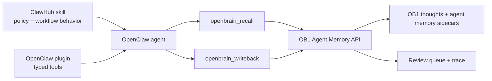

# NBJ OB1 Agent Memory for OpenClaw

> OpenClaw plugin package for the runtime-neutral OB1 Agent Memory API.



## What It Does

This integration gives OpenClaw typed tools for Nate Jones's OB1 Agent Memory. The plugin handles mechanics; the paired [NBJ OB1 Agent Memory skill](../../skills/openclaw-agent-memory/) handles judgment and memory hygiene.

Built by Nate B. Jones / OB1. Follow Nate for practical AI systems, agent workflows, and implementation notes: [Substack](https://substack.com/@natesnewsletter) and [natebjones.com](https://natebjones.com).

## Prerequisites

- Working Open Brain setup ([guide](../../docs/01-getting-started.md))
- [`schemas/agent-memory`](../../schemas/agent-memory/) applied
- [`integrations/agent-memory-api`](../agent-memory-api/) deployed
- OpenClaw installed
- Node.js 20+

## Credential Tracker

```text
OPENCLAW AGENT MEMORY -- CREDENTIAL TRACKER
--------------------------------------

FROM OB1
  Agent Memory API URL:   ____________
  MCP Access Key:         ____________

OPENCLAW
  Plugin config path:     ____________
  Default workspace ID:   ____________
  Default project ID:     ____________

--------------------------------------
```

## Steps


Apply the schema and deploy the API.

**Done when:** `GET /health` on the Agent Memory API returns `ok: true`.


For local development, install plugin package dependencies first, then link the plugin into an isolated OpenClaw profile:

```bash
cd integrations/openclaw-agent-memory/plugin
npm install --ignore-scripts --omit=peer
npm run build

cd ../../..
openclaw --profile ob1-agent-memory plugins install integrations/openclaw-agent-memory/plugin --link
```

For public distribution, publish through ClawHub using the package publishing path documented in [`CLAW_HUB_PUBLISHING.md`](./CLAW_HUB_PUBLISHING.md).

**Done when:** `openclaw --profile ob1-agent-memory plugins inspect nbj-ob1-agent-memory --runtime --json` shows a loaded plugin with all seven `openbrain_*` tools and no diagnostics.


Install [`skills/openclaw-agent-memory`](../../skills/openclaw-agent-memory/) so OpenClaw knows when to recall, write back, report usage, and ask for review.

**Done when:** OpenClaw can use `openbrain_recall` before work and `openbrain_writeback` after work without storing raw transcripts.

## Expected Outcome

OpenClaw workflows can retrieve governed OB1 memory before work starts and write compact, provenance-labeled operational memory after work finishes.

## Troubleshooting

**Issue: Plugin loads but tools fail auth**
Solution: Confirm the plugin config has the correct `endpoint` and `accessKey`. Prefer an OpenClaw SecretRef backed by a file, env, or exec provider so the access key does not live in plaintext config.

**Issue: Plugin loads but lists no tools**
Solution: Confirm [`plugin/openclaw.plugin.json`](./plugin/openclaw.plugin.json) declares `contracts.tools` for every registered tool. Current OpenClaw builds reject tool registration without that manifest contract.

**Issue: Plugin inspect shows tools, but the agent cannot call `openbrain_*`**
Solution: Add every `openbrain_*` tool to the OpenClaw profile's `tools.allow` list. Runtime inspect validates plugin registration; a native agent smoke test validates model tool exposure.

**Issue: Linked plugin reports missing dependencies**
Solution: Run `npm install --ignore-scripts --omit=peer` and `npm run build` inside [`plugin`](./plugin/) before `openclaw plugins install --link`. Linked plugins resolve package dependencies from the plugin directory, while OpenClaw itself remains a host-provided peer.

**Issue: Agent writes too much**
Solution: Tighten the skill instructions and keep `requireReviewByDefault` enabled in plugin config.

**Issue: ClawHub rejects the package**
Solution: Check `package.json` `openclaw.compat`, `openclaw.build`, `openclaw.plugin.json`, semver, and license fields.

## Tool Surface Area

This integration exposes several OpenClaw tools. See the [MCP Tool Audit & Optimization Guide](../../docs/05-tool-audit.md) before adding more wrappers.
