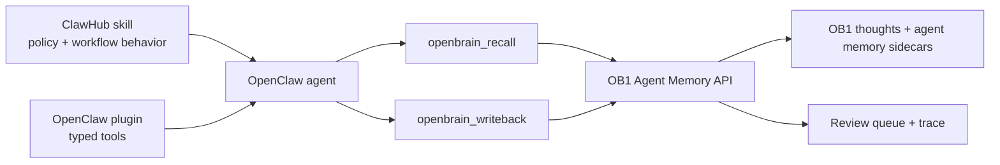

# OpenClaw Agent Memory for OB1

> OpenClaw plugin package for the runtime-neutral OB1 Agent Memory API.



## What It Does

This integration gives OpenClaw typed tools for OB1 Agent Memory. The plugin handles mechanics; the paired [OpenClaw Agent Memory skill](../../skills/openclaw-agent-memory/) handles judgment and memory hygiene.

## Prerequisites

- Working Open Brain setup ([guide](../../docs/01-getting-started.md))
- [`schemas/agent-memory`](../../schemas/agent-memory/) applied
- [`integrations/agent-memory-api`](../agent-memory-api/) deployed
- OpenClaw installed
- Node.js 20+

## Credential Tracker

```text
OPENCLAW AGENT MEMORY -- CREDENTIAL TRACKER
--------------------------------------

FROM OB1
  Agent Memory API URL:   ____________
  MCP Access Key:         ____________

OPENCLAW
  Plugin config path:     ____________
  Default workspace ID:   ____________
  Default project ID:     ____________

--------------------------------------
```

## Steps


Apply the schema and deploy the API.

**Done when:** `GET /health` on the Agent Memory API returns `ok: true`.


For local development, point OpenClaw at [`plugin/package.json`](./plugin/package.json). For public distribution, publish through ClawHub using the package publishing path documented in [`recipes/openclaw-agent-memory/`](../../recipes/openclaw-agent-memory/).

**Done when:** `openclaw plugins inspect openbrain-agent-memory` shows a loaded non-capability tool plugin.


Install [`skills/openclaw-agent-memory`](../../skills/openclaw-agent-memory/) so OpenClaw knows when to recall, write back, report usage, and ask for review.

**Done when:** OpenClaw can use `openbrain_recall` before work and `openbrain_writeback` after work without storing raw transcripts.

## Expected Outcome

OpenClaw workflows can retrieve governed OB1 memory before work starts and write compact, provenance-labeled operational memory after work finishes.

## Troubleshooting

**Issue: Plugin loads but tools fail auth**
Solution: Confirm the plugin config has the correct `endpoint` and either `accessKey` or `accessKeyEnv`.

**Issue: Agent writes too much**
Solution: Tighten the skill instructions and keep `requireReviewByDefault` enabled in plugin config.

**Issue: ClawHub rejects the package**
Solution: Check `package.json` `openclaw.compat`, `openclaw.build`, `openclaw.plugin.json`, semver, and license fields.

## Tool Surface Area

This integration exposes several OpenClaw tools. See the [MCP Tool Audit & Optimization Guide](../../docs/05-tool-audit.md) before adding more wrappers.
