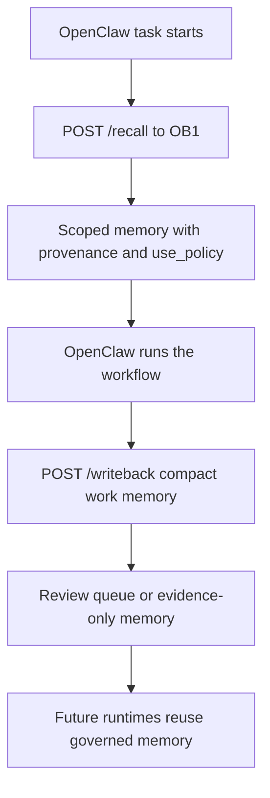

# NBJ OB1 Agent Memory for OpenClaw

This recipe makes OB1 the continuity layer for OpenClaw workflows. OpenClaw performs the work; OB1 stores the durable operational memory that future agents can inspect, trust, reject, or reuse.

Built by Nate B. Jones / OB1. Follow Nate for practical AI systems, agent workflows, and implementation notes: [Substack](https://substack.com/@natesnewsletter) and [natebjones.com](https://natebjones.com).

## Quick Path

1. Install [the Agent Memory schema](../../schemas/agent-memory/schema.sql).
2. Deploy [the Agent Memory API](../../integrations/agent-memory-api/).
3. Configure [the OpenClaw plugin](../../integrations/openclaw-agent-memory/plugin/).
4. Install [the OpenClaw Agent Memory skill](../../skills/openclaw-agent-memory/SKILL.md).
5. Start with [Code Review Memory](../openclaw-code-review-memory/) or [TaskFlow Work Log](../openclaw-taskflow-work-log/).

## Contract Files

| Contract | Purpose |
| -------- | ------- |
| [recall.schema.json](contracts/recall.schema.json) | Pre-task recall request |
| [recall-response.schema.json](contracts/recall-response.schema.json) | Policy-labeled recall response |
| [writeback.schema.json](contracts/writeback.schema.json) | Post-task memory write-back |

## Example Payloads

| Example | Purpose |
| ------- | ------- |
| [recall-request.json](examples/recall-request.json) | Minimal OpenClaw pre-task recall |
| [writeback-request.json](examples/writeback-request.json) | Compact post-task write-back |
| [usage-report.json](examples/usage-report.json) | Recall trace usage report |

## Defaults

- Agent-written memory starts as evidence, not instruction.
- Instruction-grade memory requires human confirmation or trusted import.
- Write-back requires idempotency and content-hash dedupe.
- Raw transcripts, model reasoning traces, secrets, large code blocks, and private customer dumps are blocked or flagged.
- Project scope is the default when available.
- Personal or channel memory never auto-promotes to team or workspace scope.

## What To Recall

Recall should be narrow and useful:

- decisions
- constraints
- lessons
- prior attempts
- owners
- source-backed facts
- relevant artifacts

Do not inject every semantically related thought. The response includes `use_policy`; OpenClaw agents must respect it.

## What To Write Back

Write back compact operational memory:

- decisions
- outputs
- lessons
- constraints
- unresolved questions
- next steps
- failures
- artifact references

Do not store transcripts or scratchpads by default. Store source references instead.

## Visual Assets

Use [the Agent Memory visual asset pack](../../docs/assets/agent-memory/) for Linear issue docs, repo docs, and tutorial material.

## Portability

V1 uses Supabase/Postgres because OB1 runs there now, but the API contract is designed to avoid storage lock-in. SQLite/local support is not part of the launch scope; it is a future migration-assistant path documented in [OB1 Agent Memory Storage Portability](../../docs/agent-memory-portability.md).
