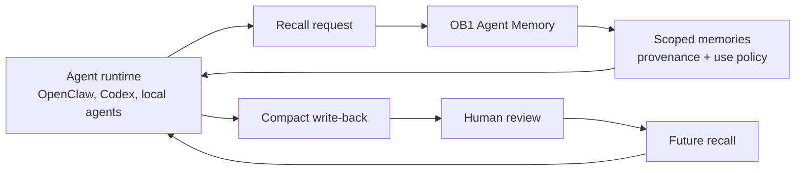

# Agent Memory

> Governed operational memory for agent runtimes, with provenance, review, recall traces, and audit trails.



## What It Does

This schema adds sidecar tables that let Open Brain store agent-created operational memory safely. The core `thoughts` table remains the content store; agent memory records add provenance, confidence, scope, use policy, review status, source references, recall traces, and audit events.

## Prerequisites

- Working Open Brain setup ([guide](../../docs/01-getting-started.md))
- Supabase project with the core `thoughts` table
- The core dedupe setup from Step 2.6 is recommended

## Credential Tracker

```text
AGENT MEMORY -- CREDENTIAL TRACKER
--------------------------------------

SUPABASE (from your Open Brain setup)
  Project URL:           ____________
  Secret key:            ____________

--------------------------------------
```

## Steps


Open Supabase SQL Editor, paste the contents of [`schema.sql`](./schema.sql), and run it.

**Done when:** Table Editor shows `agent_memories`, `agent_memory_recall_traces`, `agent_memory_recall_items`, and `agent_memory_audit_events`.


Run this query:

```sql
SELECT column_name, column_default
FROM information_schema.columns
WHERE table_name = 'agent_memories'
  AND column_name IN (
    'can_use_as_instruction',
    'can_use_as_evidence',
    'requires_user_confirmation',
    'review_status'
  );
```

**Done when:** instruction defaults to `false`, evidence defaults to `true`, confirmation defaults to `true`, and review defaults to `pending`.


Deploy the runtime API from [`../../integrations/agent-memory-api/`](../../integrations/agent-memory-api/).

**Done when:** `GET /health` on the deployed API returns `{"ok":true}`.

## Expected Outcome

After applying this schema, OB1 can store agent memories as governed records instead of raw transcript dumps. Agent-written memories start as evidence-only pending review. Only `user_confirmed` or trusted `imported` memories can become instruction-grade.

## Troubleshooting

**Issue: `agent-memory requires public.thoughts`**
Solution: Run the core Open Brain setup first.

**Issue: instruction-grade write fails**
Solution: This is usually correct. `can_use_as_instruction` is only allowed for `user_confirmed` or `imported` memory.

**Issue: API cannot read tables**
Solution: Re-run the GRANT section at the bottom of `schema.sql` and redeploy the Edge Function so PostgREST reloads the schema cache.
