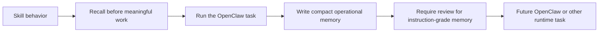

# OpenClaw Agent Memory Skill Pack

This skill gives OpenClaw agents a disciplined way to use OB1 Agent Memory. It pairs with the [OpenClaw Agent Memory integration](../../integrations/openclaw-agent-memory/) and the runtime-neutral [OB1 Agent Memory API](../../integrations/agent-memory-api/).

## Install

Copy [SKILL.md](SKILL.md) into the OpenClaw skill location or package it through the ClawHub publishing flow documented in [CLAW_HUB_PUBLISHING.md](../../integrations/openclaw-agent-memory/CLAW_HUB_PUBLISHING.md).

## What It Enforces

| Rule | Why |
| ---- | --- |
| Recall before meaningful work | The agent starts with scoped project context |
| Respect `use_policy` | Evidence is not silently promoted into instruction |
| Write back compact memory | OB1 stores operational knowledge, not transcript dumps |
| Include provenance | Future agents can trust, reject, or inspect the memory |
| Report usage | Recall traces become debuggable |

## Paired Recipes

- [OpenClaw Agent Memory for OB1](../../recipes/openclaw-agent-memory/)
- [OpenClaw Code Review Memory](../../recipes/openclaw-code-review-memory/)
- [OpenClaw TaskFlow Work Log](../../recipes/openclaw-taskflow-work-log/)
